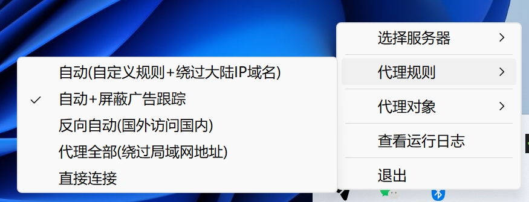

# Easyss

Easyss是一款兼容socks5的安全代理上网工具，目标是使访问国外技术网站更流畅免受干扰。

有报道表明访问国外技术网站正变得越来越困难，即使用了一些常用代理技术也面临被干扰的可能性。
为了以防万一，提前准备，重新实现了一套协议以加快访问速度和对抗嗅探。

## 特性

* 简单稳定易用, 没有复杂的配置项; 无流量特征，不易被嗅探
* 全平台支持(Linux, MacOS, Windows, Android等)
* 支持SOCKS5(TCP/UDP, thanks [socks5](https://github.com/txthinking/socks5))、HTTP 代理协议
* 支持浏览器级别代理(设置系统代理), 和系统全局代理(thanks [tun2socks](https://github.com/xjasonlyu/tun2socks)); 可选代理规则
* 支持TCP连接池 (默认启用，大幅降低请求延迟)
* 支持系统托盘图标管理 (thanks [systray](https://github.com/getlantern/systray))
* 可配置多服务器切换; 自定义直连白名单(IP/域名)
* 基于TLS底层传输(可禁用); 上层支持AEAD类型高强度加密通信, 如aes-256-gcm, chacha20-poly1305
* http2帧格式交互 (更灵活通用, 更易扩展)
* 支持多种出口协议: `native`, `http`, `https`; 以适应各种复杂场景
* 支持服务端(easyss-server)链式代理
* 内建DNS服务器，支持DNS Forward转发，可用于透明代理部署时使用 (默认关闭，可通过命令行启用)

## 下载安装

### 在release页面直接下载(各平台)编译好的二进制文件

[去下载](https://github.com/nange/easyss/releases)

### 或者 通过源码安装(go version 1.21+ is required)

```sh
// Ubuntu20.04 or Debian11 
apt-get install gcc libgtk-3-dev libayatana-appindicator3-dev -y

// Ubuntu18.04 or Debian10
apt-get install gcc libgtk-3-dev libappindicator3-dev -y

// build easyss client
make easyss

// build easyss server
make easyss-server

```

## 用法

### 客户端
创建配置文件：`config.json`，并把配置文件放入`easyss`二进制相同目录中。

**单服务器配置文件示例：**
```json
{
  "server": "your-domain.com",
  "server_port": 9999,
  "password": "your-pass",
  "local_port": 2080,
  "method": "aes-256-gcm",
  "timeout": 60,
  "bind_all": false,
  "outbound_proto": "native",
  "log_file_path": "easyss.log"
}
```

**多服务器配置文件示例：**
```json
{
  "server_list": [
    {
      "server": "your-domain.com",
      "server_port": 7878,
      "password": "your-pass",
      "default": true
    },
    {
      "server": "your-domain2.com",
      "server_port": 9898,
      "password": "your-pass2"
    }
  ],
  "local_port": 2080,
  "method": "aes-256-gcm",
  "timeout": 60,
  "bind_all": false,
  "ca_path": "",
  "log_file_path": "easyss.log"
}
```

**参数说明：**
* server: 服务器地址(必填，没有配置自定义证书情况下，必须是域名不能是IP，使用自定义证书可以是IP)
* server_port: 服务器对应端口(必填)
* password: 通信加密密钥(必填)
* local_port: 本地监听端口(默认2080)
* method: 通信加密方式(默认aes-256-gcm)
* timeout: 超时时间,单位秒(默认60)
* bind_all: 是否将监听端口绑定到所有本地IP上(默认false)
* ca_path: 自定义CA证书文件路径(当使用自定义tls证书时才配置)
* outbound_proto: 出口协议，默认`native`，可选：`native`, `http`, `https`
* log_file_path: 日志文件路径，为空则输出到系统标准输出

其他还有一些参数没有列出，如无必要，无需关心。除了3个必填的参数，其他都是可选的，甚至可以不要配置文件，全部通过命令行指定即可。

如需查看完整配置参数，可执行：`./easyss -show-config-example`

保存好配置文件后，双击`easyss`，程序会自动启动，托盘会出现Easyss的图标，如下:




右键图标可选择代理规则和代理对象。

**注意：代理对象，选择系统全局流量时，需要管理员权限。**

**自定义直连白名单：**

对于少部分国内的IP/域名，或者部分特殊的IP/域名，可能`Easyss`没有正确识别，造成本该直连的IP/域名走了代理，
这时可在`easyss`所在目录下， 新建`direct_ips.txt`, `direct_domains.txt`， 分别用于存储直连IP列表和直连域名列表，每行一条记录。

`direct_ips.txt`文件示例：
```text
39.156.66.10
110.242.68.66
106.11.84.3
206.0.68.0/23
```

`direct_domains.txt`文件示例：
```text
baidu.com
taobao.com
your-custom-domain.com
```

### 手机客户端

手机客户端EasyssTun.apk文件可直接在[release页面](https://github.com/nange/easyss/releases)下载。

注意: 可将常用的国内大流量APP勾选上跳过，这样可减少电量消耗。当然不选也没关系，Easyss会自动判断该直连还是走代理。

### 服务器端
和客户端一样, 同样先创建配置文件`config.json`，并配置文件和二进制`easyss-server`放同一目录中。

**服务端配置文件示例：**
```json
{
    "server": "your-domain.com",
    "server_port": 9999,
    "password": "your-pass",
    "timeout": 60,
    "cert_path": "",
    "key_path": ""
}
```
保存config.json文件, 其中`server`(在没有使用自定义证书情况下必填且为服务器域名地址)、`server_port`和`password`必填, 
`cert_path`, `key_path`只有在使用自定义证书时配置，这两参数不为空则表示使用自定义tls证书，而非自动获取。

执行:
```sh
./easyss-server
```

**注意：在没有使用自定义证书且没有禁用TLS情况下，服务器的443端口必须对外可访问，用于自动获取服务器域名证书的TLS校验使用。
并且这种情况需要sudo权限运行easyss-server**

#### docker部署

docker run -d --name easyss --network host nange/docker-easyss:latest -p yourport -k yourpassword -s yourdomain.com

### 自定义证书
默认情况下，`easyss-server`端部署时配置了域名，则会自动从`Let's Encrypt`获取tls证书，用户无需操心证书配置。
但这要求我们必须有自己的域名，这加大了使用Easyss的难度。如果我们没有自己的域名，也可以通过自定义tls证书来使用Easyss。

#### 生成自定义证书
可根据自己的需求，使用`openssl`等工具生成自定义证书。也可以参考： `./scripts/self_signed_certs` 目录示例，使用`cfssl`生成自定义证书。
示例就是使用IP而不是域名生成自定义证书，这样就可以无域名使用Easyss了。

## 高级用法
### 服务器部署在反向代理之后
默认Easyss的出口协议为`native`，是基于TCP的一种特有协议。
但由于各种网络情况的客观复杂性，有可能我们的Easyss-server服务器只能部署于HTTP(s)反向代理之后的，
这时候`native`协议将无法工作，因此easyss支持了三种出口协议可选：`native`, `http`, `https`。
`http`和`https`出口协议是对`native`的包装，基于tcp over http(s)技术实现。
如果可能的话应该优先使用`native`协议，因为其性能和延迟都有最好的表现。

在Easyss配置文件中，指定`outbound_proto: http` 或者 `outbound_proto: https`，
并在Easyss-server配置文件中，指定`enable_http_inbound: true`，即可实现服务器部署在反向代理之后的场景。
如果`outbound_proto: http`，还需要在Easyss-server配置文件中禁用tls：`disable_tls: true`

### 启动前或定期执行自定义命令
同时Easyss还支持配置`cmd_before_startup`, `cmd_interval`参数，用于配置一个自定义命令，在Easyss启动前执行或者定期的执行。
`cmd_interval_time`可用于控制定期执行间隔，默认10分钟执行一次。

### 作为透明代理将Easyss部署在路由器或者软路由上
直接将Easyss部署在路由器或这软路由上，可实现家里或公司网络自动透明代理，无需在终端设备上安装Easyss客户端。

只需要在配置文件或者命令行指定`enable_tun2socks: true` 或者 `-enable-tun2socks=true`开启全局代理，
并同时开启DNS流量转发`enable_forward_dns: true` 或者`-enable-forward-dns=true`，即可实现透明代理。

### 服务端链式代理
服务端(`easyss-server`)支持将请求再次转发给下一个代理(目前只支持`socks5`)。
如服务器IP被ChatGPT屏蔽了，可以在服务器上部署上`Warp`，然后`easyss-server`将ChatGPT相关的请求转发给`Warp`，这样可突破ChatGPT的封锁。

只需要在配置文件中指定`next_proxy_url: "socks5://your-ip:your-port"`，
然后在`easyss-server`目录下创建`next_proxy_domains.txt`, `next_proxy_ips.txt`文件，用于指定对哪些域名或IP地址走链式代理。
也可以在配置文件中手动指定自定义文件路径：`next_proxy_domains_file: "your_custom_domain_file.txt"`, `next_proxy_ips_file: "your_custom_ip_file.txt"`。
如果想链式代理所有地址的请求，则可以配置：`enable_next_proxy_all_host: true`。

另外需要注意的是，链式代理默认是不转发`UDP`请求的，主要原因是很多`socks5`代理都不支持`UDP`请求，如`Warp`就不支持。
如果确定自己的代理是支持`UDP`请求的，又想开启`UDP`请求链式代理，则可以配置: `enable_next_proxy_udp: true`。

## LICENSE

MIT License
